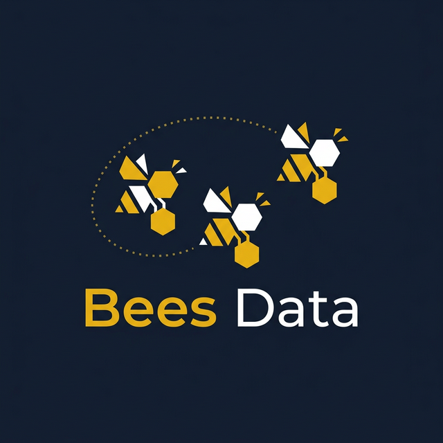
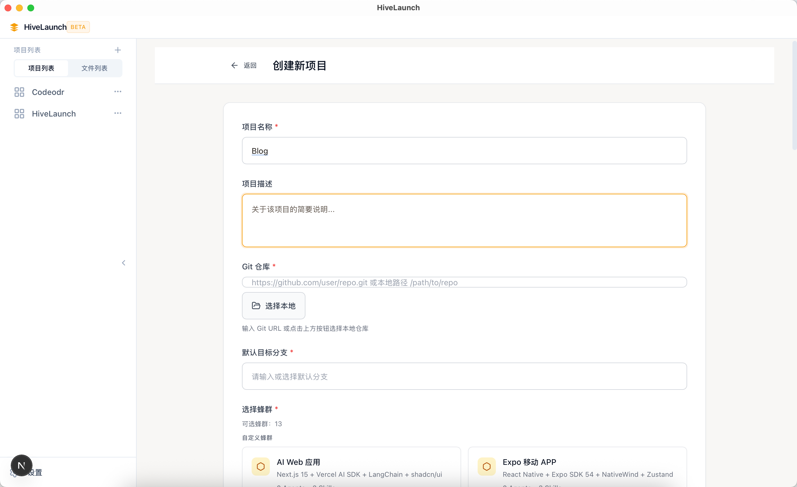
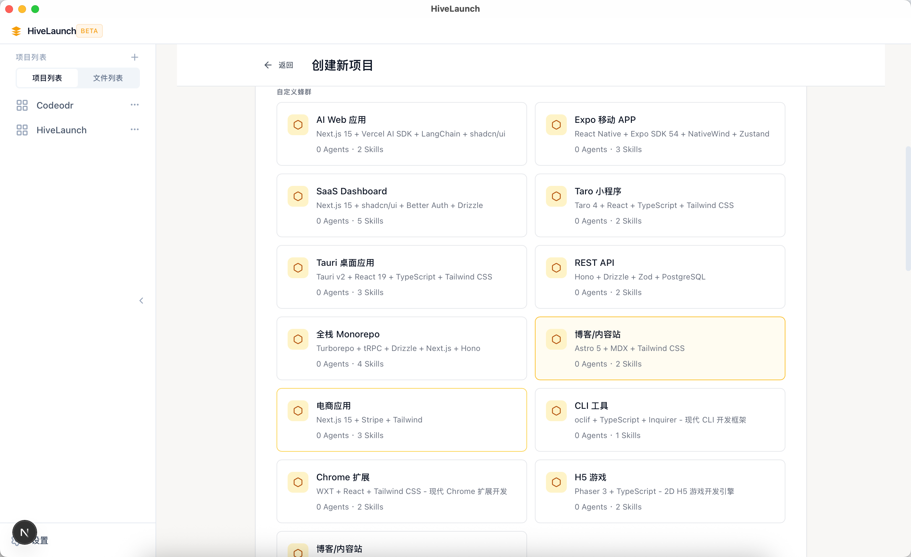
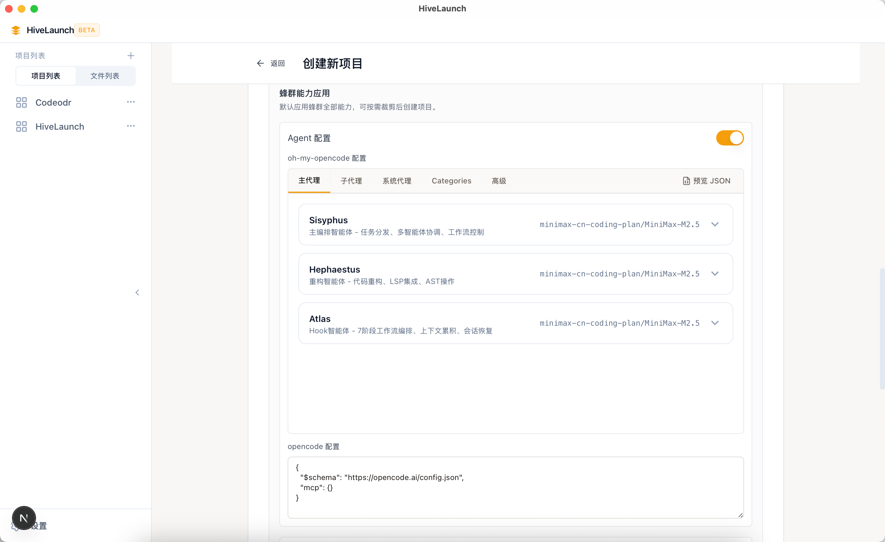
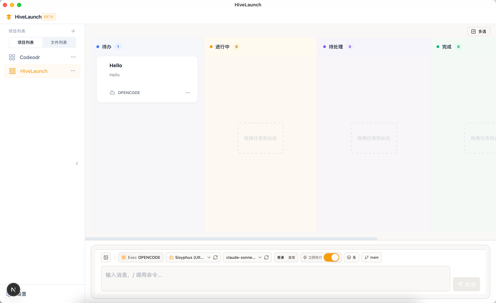
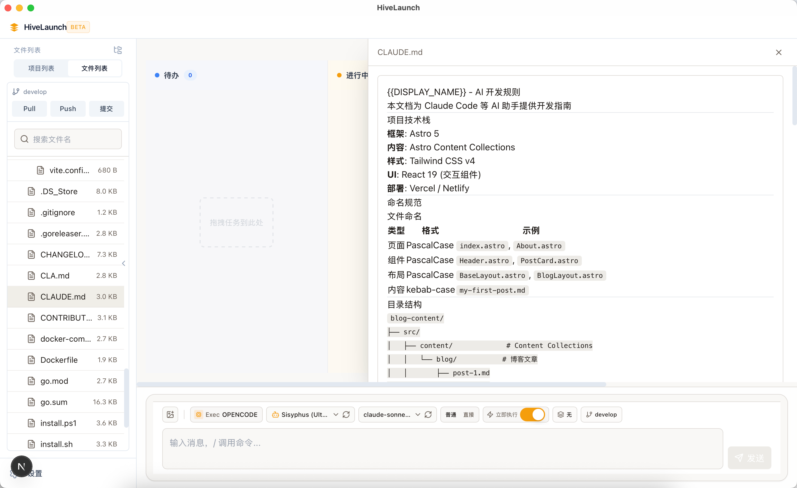
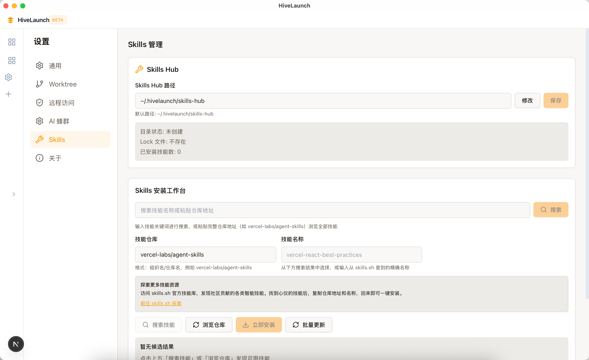
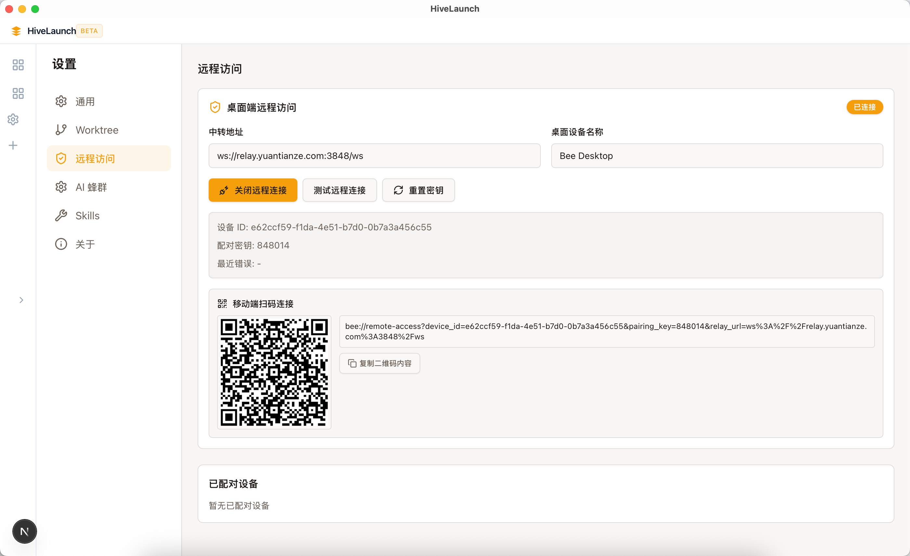
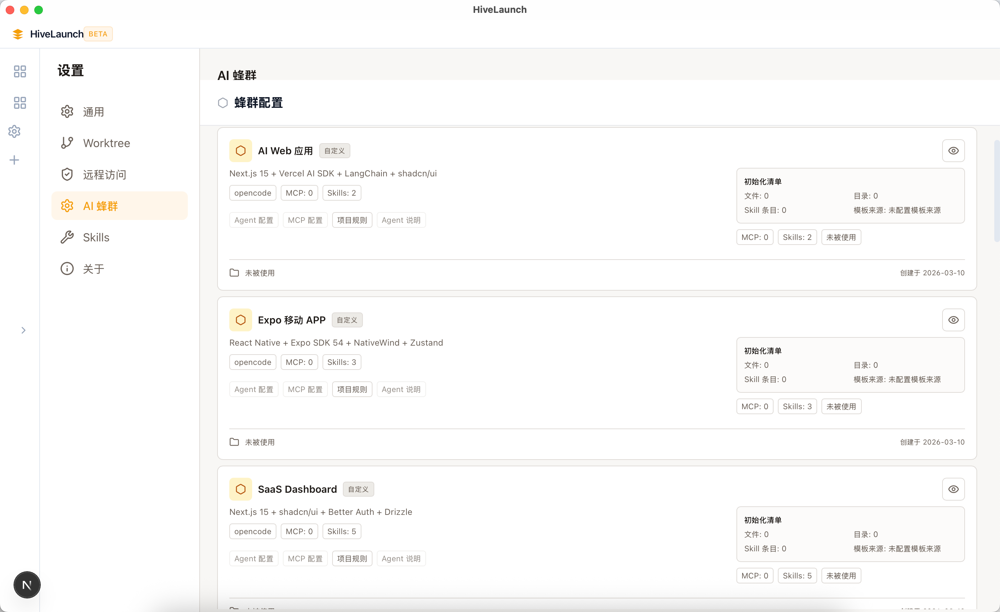

# 蜂启 HiveLaunch

<p align="center">
  
</p>

<p align="center">
  <strong>本地优先的 AI 开发平台</strong>
</p>

<p align="center">
  用脚手架定义 AI 工作边界，用看板执行任务，用蜂群配置管理 Agent。
</p>

<p align="center">
  <a href="https://github.com/hivelaunch/hivelaunch/releases">
    
  </a>
  <a href="./LICENSE">
    
  </a>
  
  
</p>

<p align="center">
  <a href="https://github.com/hivelaunch/hivelaunch">GitHub</a> •
  <a href="https://gitee.com/hivelaunch/hivelaunch">Gitee 镜像</a>
</p>

---

## 这是什么

HiveLaunch 是一个**本地优先**的 AI 开发平台，解决三类典型问题：

| 问题 | 解法 |
|------|------|
| 配置太重 | 脚手架（Scaffold）一键生成项目骨架、规则文件与蜂群配置 |
| 执行不可视 | 看板即执行（Kanban as Execution），每张卡片对应一次真实 AI 执行 |
| 协作不连续 | 本地后端 + 桌面/移动端协同，离开电脑也能掌控进度 |

**适合**：想在本地进行AI开发又不想进行繁琐配置来回切换的开发者和团队


## 多端架构

| 端 | 定位 | 连接方式 |
|---|---|---|
| **Desktop** | 主操作端 | 直连 `localhost:3847` |
| **Web** | 开发预览 | 通过 rewrites 代理到 `3847` |
| **Mobile** | 远程协同 | 局域网直连 或 Relay (`:3848`) 加密转发 |

### Desktop（桌面端）

- 完整开发工作流：从脚手架初始化到任务执行与合并
- 项目级配置：Swarm、Worktree、规则与连接参数
- 作为本地控制中心，Rust API 运行在本机

### Web（网页端）

- 与Desktop功能一致
- 执行通过web端进行访问
- 为团队提供不同的运行方式

### Mobile（移动端）

- 远程连接 Desktop，持续跟踪任务进度
- 支持扫码或手动输入 `device_id` / `pairing_key` 完成配对
- 可切换连接模式：局域网直连 或 Relay

## 核心能力

### 场景化脚手架（Scaffold）

按模板生成项目骨架、规则文件与蜂群配置，内置模板：

| 模板 | 说明 |
|------|------|
| Expo React Native | 跨平台移动应用模板 |

模板可定义 Agent 配置覆盖层与 MCP 配置，让 AI 直接进入可控执行状态。

### 看板即执行（Kanban as Execution）

每张卡片对应一次真实 AI 执行，状态按任务生命周期流转：

```
待办 → 进行中 → 待合并 → 完成
```

### 蜂群配置（Swarm Config）

统一管理 Agent、Skills、MCP，支持：

- **多 Agent 支持**：OpenCode、Claude、Cursor、Gemini、Copilot 等
- **OpenCode 深度集成**：可视化配置编辑器、模型选择器、Agent 发现
- **MCP 服务管理**：配置 Model Context Protocol 服务

### 本地优先 + 远程协同

- 后端默认本机运行（`localhost:3847`）
- 业务逻辑统一走 HTTP API（三端一致）
- Tauri IPC 仅用于系统能力（文件选择、通知、窗口控制）

## 产品功能

### 场景脚手架

从模板快速生成项目骨架与 AI 执行规则。支持自定义模板，定义 Agent 配置覆盖层与 MCP 配置，让 AI 直接进入可控执行状态。

<p align="center">
  
</p>
<p align="center">
  
</p>
<p align="center">
  
</p>

### 看板任务执行

把需求拆成卡片并派发给 AI 执行，全流程可追踪。状态按任务生命周期流转：待办 → 进行中 → 待合并 → 完成。

<p align="center">
  
</p>

### 会话与执行面板

同一界面查看对话、命令输出、文件改动与执行状态。实时掌握 AI 执行进度与结果产出。

<p align="center">
  
</p>

### 配置中心

统一配置 Agent、Skills、MCP，按项目范围生效。支持多 Agent 可视化配置，搜索相关skills和mcp一键加载到项目中。

<p align="center">
  
</p>

### 移动端远程访问

支持多端访问配置。可以通过手机随时查看AI任务执行计划，调整任务内容。保证AI任务执行不停歇。

<p align="center">
  
</p>

### AI蜂群配置

支持通过已定义好的模板直接进行产品开发，无需繁琐的配置。根据业务场景选择匹配技术栈一键进入AI开发。

<p align="center">
  
</p>

## 安装与使用

### 方式 A：普通用户（桌面安装包）

1. 打开 GitHub Releases：<https://github.com/hivelaunch/hivelaunch/releases>
2. 根据系统下载对应安装包（macOS / Windows / Linux）
3. 安装并启动 HiveLaunch
4. 进入应用后按"首次使用流程"创建并运行任务

> [!NOTE]
> 如果当前版本尚未提供对应平台安装包，可使用"方式 B"源码运行。

### 方式 B：开发者（源码运行）

**环境要求：** Node.js 20+、pnpm 9、Rust 工具链

```bash
# 安装依赖
pnpm install

# 启动桌面开发（Tauri）
pnpm dev

# 仅启动 Web
pnpm dev:web

# 仅启动 Rust 后端
pnpm dev:rust
```

**端口说明：**

| 服务 | 端口 |
|------|------|
| Web 开发 | 3000 |
| Rust API | 3847 |
| Relay | 3848 |

### 首次使用流程（3 分钟）

1. 创建项目并选择场景模板（Scaffold）
2. 在项目设置中配置 Swarm（Agent / Skills / MCP）
3. 在看板创建任务卡片并派发执行
4. 在执行面板查看 AI 输出与文件改动
5. 完成后走合并流程，进入下一个任务

### 移动端接入步骤（配合桌面端）

1. 先在桌面端打开远程访问并生成配对信息
2. 在移动端扫码或粘贴配对内容完成连接
3. 按网络环境选择 IP 直连或 Relay 模式
4. 连接成功后在移动端查看任务与执行状态

## 项目结构

```
HiveLaunch/
├── apps/web/              # Next.js 前端应用
├── features/              # 业务模块
│   ├── agent-execution/   # AI 执行器
│   ├── kanban/            # 看板系统
│   ├── scaffold/          # 脚手架/模板
│   ├── swarm-config/      # 蜂群配置
│   ├── settings/          # 设置
│   └── token-usage/       # Token 统计
├── infra/
│   ├── tauri/             # Tauri + Rust 服务端
│   └── db/                # 本地 SQLite
├── packages/
│   ├── bee-executor/      # 执行器核心（支持 OpenCode 等）
│   ├── bee-container/     # 容器化支持
│   ├── bee-workspace-*/   # 工作区工具
│   ├── shared-types/      # 共享类型
│   └── shared-ui/         # 共享 UI 组件
└── CLAUDE.md              # 工程规则索引
```

## 技术栈

| 层级 | 技术 |
|------|------|
| 桌面框架 | [Tauri 2.x](https://tauri.app/) |
| 前端框架 | [Next.js 15](https://nextjs.org/) + [React 19](https://react.dev/) |
| 状态管理 | [Zustand](https://zustand-demo.pmnd.rs/) + [TanStack Query](https://tanstack.com/query) |
| 表单验证 | [React Hook Form](https://react-hook-form.com/) + [Zod](https://zod.dev/) |
| 后端服务 | Rust + [Axum](https://github.com/tokio-rs/axum) |
| 数据库 | SQLite + [Drizzle ORM](https://orm.drizzle.team/) |
| UI 组件 | [Tailwind CSS](https://tailwindcss.com/) + [shadcn/ui](https://ui.shadcn.com/) |
| AI 执行器 | OpenCode / Claude / Cursor / Gemini 等 |

## 开发命令

```bash
# 构建
pnpm build
pnpm build:tauri

# 质量检查
pnpm lint
pnpm typecheck

# 测试
pnpm --filter @hivelaunch/web test:run
```

## 开发指南

欢迎贡献代码。开发前请先阅读 [`CLAUDE.md`](./CLAUDE.md) 了解工程规则与编码规范。

**提交前必须通过：**

```bash
pnpm lint && pnpm typecheck
```

> [!TIP]
> 详细规则索引见 [`rules/`](./rules/) 目录，按任务类型查阅对应文件。

---

主项目采用自定义许可证，详见 [LICENSE](./LICENSE)；`packages/bee-executor` 采用 Apache License 2.0，详见 [NOTICE](./NOTICE)。
